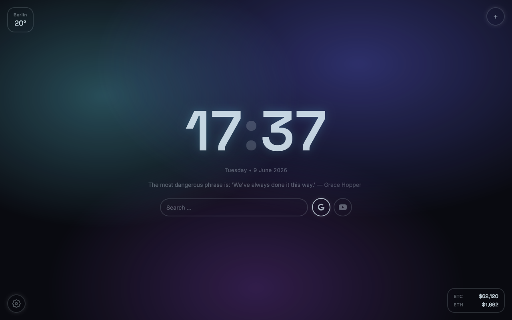
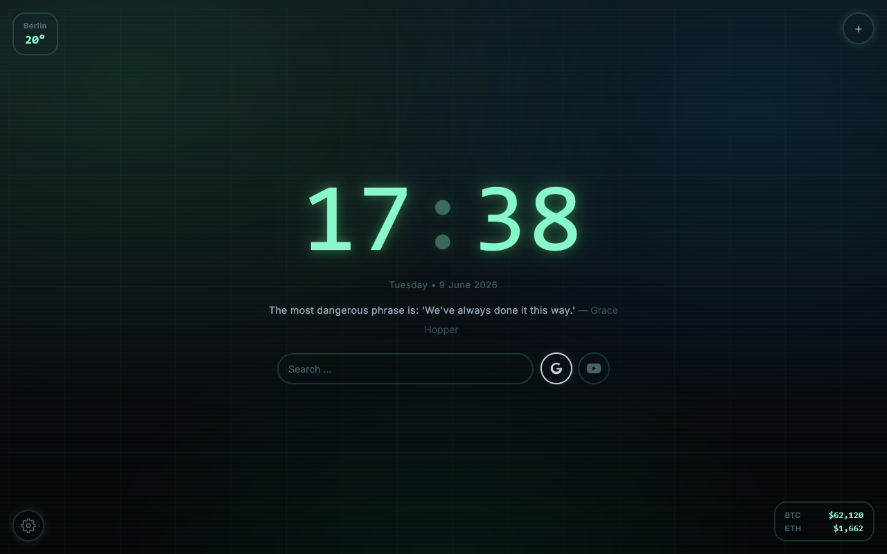
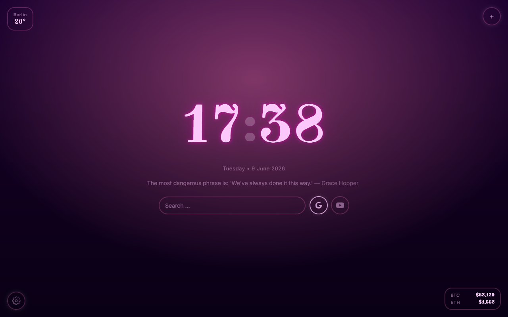
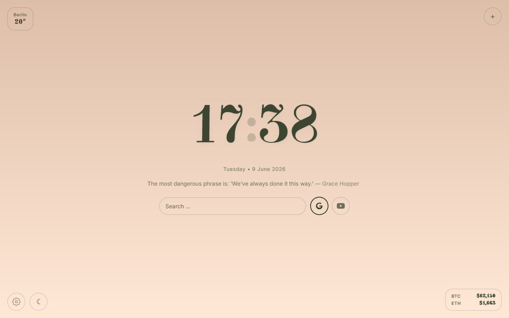

<div align="center">

# 🌃 SinTab

### A minimal, beautiful new tab page for Firefox

[](https://addons.mozilla.org/en-US/firefox/addon/sintab/)
[](LICENSE)
[](manifest.json)

[Install on Firefox](https://addons.mozilla.org/en-US/firefox/addon/sintab/) • [Report Bug](https://github.com/WoasSinab/sintab/issues) • [Request Feature](https://github.com/WoasSinab/sintab/issues)

</div>

---

## ✨ Features

- ⏰ **Real-time clock** with unique fonts per theme
- 🌤️ **Live weather** for any city worldwide
- 💬 **Daily quotes** (click to refresh)
- 🔍 **Quick search** with Google & YouTube
- ₿ **Live crypto prices** (BTC & ETH via Kraken)
- 🎨 **9 stunning themes** with unique personalities
- 🌓 **Light/Dark toggle** for select themes
- 💾 **Local storage** — no account needed
- 🔒 **Zero tracking** — your data stays yours

---

## 🎨 Themes

| Theme | City | Style |
|-------|------|-------|
| 🌃 Cyberpunk | Tokyo | Neon, futuristic, Blade Runner |
| 🌌 Aurora | Berlin | Neon, deep, modern |
| 🖼️ Noir Art | Paris | Dark, artistic, gallery |
| ✏️ Marker | Helsinki | Hand, playful, clean |
| 💻 Dev | San Francisco | Coding, terminal, VS Code |
| 🌅 Retro Wave | Los Angeles | 80s, synth, sunset |
| 🌿 Sage | Rome | Earthy, calm, aesthetic |
| 👑 Royal | London | Prestige, champagne, deep |
| 💎 Noble | Vienna | Elegant, sophisticated |

---

## 📸 Screenshots

<!-- اگه عکس داری اینجا اضافه کن -->
<!-- 




-->

---

## 🚀 Installation

### From Firefox Add-ons Store (Recommended)

[**Install SinTab**](https://addons.mozilla.org/en-US/firefox/addon/sintab/)

### Manual Installation (Development)

1. Clone the repository:

```bash
git clone https://github.com/WoasSinab/sintab.git
```

2. Open Firefox and go to `about:debugging`

3. Click **This Firefox** → **Load Temporary Add-on**

4. Select the `manifest.json` file from the cloned folder

---

## 🛠️ Tech Stack

- **Pure JavaScript** — No frameworks, no bundlers
- **CSS Variables** — Theme system
- **Browser Storage API** — Local persistence
- **Open APIs**:
  - [Open-Meteo](https://open-meteo.com) — Weather data
  - [Kraken](https://kraken.com) — Crypto prices

---

## 🔒 Privacy

SinTab collects **zero personal data**:

- ✅ All settings stored locally
- ✅ No analytics, no tracking
- ✅ No external scripts
- ✅ No accounts needed

The only network requests are to:
- Open-Meteo (weather)
- Kraken (crypto prices)

---

## 📁 Project Structure

```
sintab/
├── manifest.json       # Extension manifest
├── newtab.html         # Main UI
├── newtab.js           # All logic
├── newtab.css          # All styles
├── quotes.json         # Quotes database
├── fonts/              # Custom fonts
└── icons/              # Extension icons
```

---

## 🤝 Contributing

Contributions are welcome! Feel free to:

1. Fork the repo
2. Create a feature branch (`git checkout -b feature/AmazingFeature`)
3. Commit your changes (`git commit -m 'Add some AmazingFeature'`)
4. Push to the branch (`git push origin feature/AmazingFeature`)
5. Open a Pull Request

---

## ❤️ Support

If you enjoy SinTab, consider supporting development:

| Crypto | Address |
|--------|---------|
| **ETH** | `0xD0330731bAe9B08300cad2cF33b7A44dE366f849` |
| **TRX** | `TWVE1WzdQomKjFkL7HrtxdrMqdyfT7VByv` |
| **TON** | `UQB_yIzgCAqi4nil73IsOQWNrxi7Gxy1Z0URY6819qubJbxX` |

Or just ⭐ this repo!

---

## 📄 License

This project is licensed under the **Mozilla Public License 2.0** — see the [LICENSE](LICENSE) file for details.

---

## 👨‍💻 Author

**Sinab** — [GitHub](https://github.com/WoasSinab)

---

<div align="center">

Made with ❤️ for the Firefox community

</div>